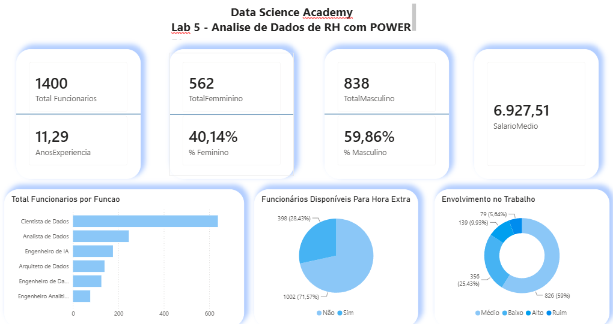

📊 Análise de Dados de Recursos Humanos com Power BI
📌 Sobre o projeto

Este projeto foi desenvolvido durante o curso da Data Science Academy com o objetivo de aplicar técnicas de análise de dados e construção de dashboards no Power BI.

O dashboard apresenta indicadores de Recursos Humanos (RH), permitindo analisar informações sobre o quadro de funcionários, distribuição por gênero, média salarial, tempo médio de experiência, disponibilidade para horas extras, nível de envolvimento no trabalho e distribuição de colaboradores por função.

## 📷 Dashboard

📈 Indicadores apresentados
* Total de funcionários
* Distribuição por gênero
* Percentual de funcionários por gênero
* Salário médio
* Média de anos de experiência
* Funcionários disponíveis para hora extra
* Envolvimento no trabalho
* Total de funcionários por função

🛠️ Ferramentas utilizadas
* Power BI
* Power Query
* Modelagem de Dados
* Transformação e tratamento de dados
* Visualização de Dados

🎯 Objetivo

* Desenvolver um dashboard interativo que permita visualizar indicadores de RH de forma clara, auxiliando na análise dos dados e apoiando a tomada de decisão.
